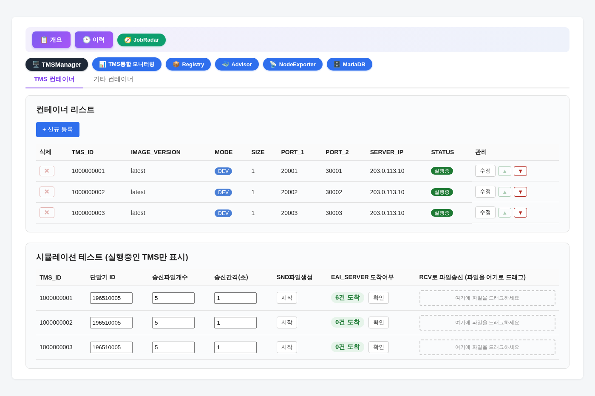
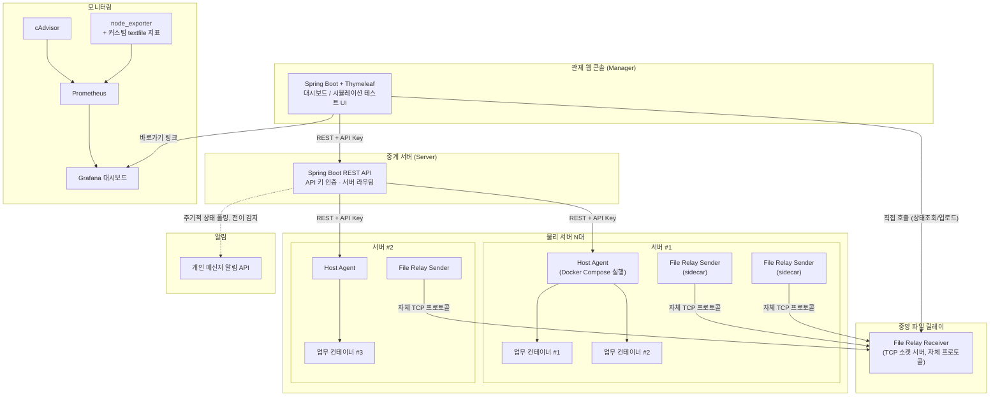

# 컨테이너 오케스트레이션 & 통합 관제 플랫폼

## 한 줄 요약

여러 물리 서버에 흩어져 실행되는 다수의 독립 업무 컨테이너를, 하나의 웹 콘솔에서
생성·기동·모니터링·알림까지 통합 관리할 수 있게 만든 백엔드/인프라 프로젝트입니다.
Spring Boot 기반 3-tier 관제 시스템, TCP 소켓 기반 커스텀 파일 릴레이 시스템, Prometheus/Grafana
모니터링 확장, 카카오톡 알림 연동을 처음부터 설계·구현했습니다.

## 실행 화면

※ 서버 IP·컨테이너 ID는 예시 값으로 치환했습니다. 실제 화면 레이아웃/컴포넌트는 그대로입니다.

## 배경 및 문제 정의

- 업무 컨테이너 인스턴스가 여러 물리 서버에 분산 배치되어 있어, 서버별로 SSH 접속해서
  `docker-compose up/down`을 수동으로 실행해야 했고, 상태를 한눈에 파악할 방법이 없었음
- 인스턴스 간 파일 연동(발신/수신)이 필요한데, 기존 방식은 검증되지 않은 임시 스크립트에 의존
- 인프라 모니터링(CPU/메모리/컨테이너 상태)은 있었지만, 업무 지표(처리 건수 등)는 별도로 확인할 방법이 없었음
- 장애(컨테이너 다운) 발생 시 담당자가 화면을 계속 보고 있어야만 알 수 있었음

## 시스템 아키텍처

### 계층 구조와 설계 의도

| 계층 | 역할 | 왜 이렇게 나눴나 |
|---|---|---|
| **Manager** | 웹 UI, 사용자 조작 진입점 | 화면/사용성 관심사를 인프라 제어 로직과 분리 |
| **Server** | 인증(API 키), 요청 라우팅, 상태 캐싱 | Manager가 어떤 물리 서버에 어떤 인스턴스가 있는지 몰라도 되게 함 — 인스턴스가 나중에 다른 서버로 이전되어도 Manager 쪽 코드 변경 불필요 |
| **Agent** | 실제 `docker-compose` 실행, 파일시스템 조작 | 물리 서버마다 1개씩 상주. 인증된 요청만 실제 명령을 실행 |
| **File Relay (Sender/Receiver)** | 인스턴스별 파일 발신/수신 중계 | HTTP가 아닌 자체 TCP 바이너리 프로토콜로 구현 — 대용량 파일 스트리밍과 pull 기반 수신을 모두 지원해야 했기 때문 |

## 핵심 성과

- **가동/중지, 신규 등록, 삭제를 웹 UI에서 원클릭으로 처리** — 서버별 SSH 접속 불필요
- **인스턴스 최대 1000개 이상 확장 가능한 구조**로 설계 (Server가 DB 기반 라우팅 테이블로 물리 서버 위치를 관리)
- **자체 TCP 프로토콜로 파일 릴레이 시스템을 처음부터 구현** — 기존 운영 중인 실데이터를 건드리지 않도록 "베이스라인 보호" 로직 적용(서비스 시작 시점에 이미 존재하던 파일은 영구히 처리 대상에서 제외)
- **Prometheus/Grafana 인프라 모니터링에 업무 지표를 통합** — textfile collector를 활용해 커스텀 지표를 추가하고, 기존 대시보드에 자연스럽게 편입
- **장애 알림 자동화** — 상태 폴링 로직에 전이 감지를 추가해 인스턴스 다운/복구 시 담당자 개인 메신저로 즉시 알림
- **동기 블로킹 API를 비동기로 리팩터링**해서 UI 응답성 개선 (자세한 내용은 CASE_STUDIES 참고)

자세한 기술적 문제해결 사례는 [`CASE_STUDIES.md`](./CASE_STUDIES.md)를, 사용 기술 스택은
[`TECH_STACK.md`](./TECH_STACK.md)를 참고해 주세요.
